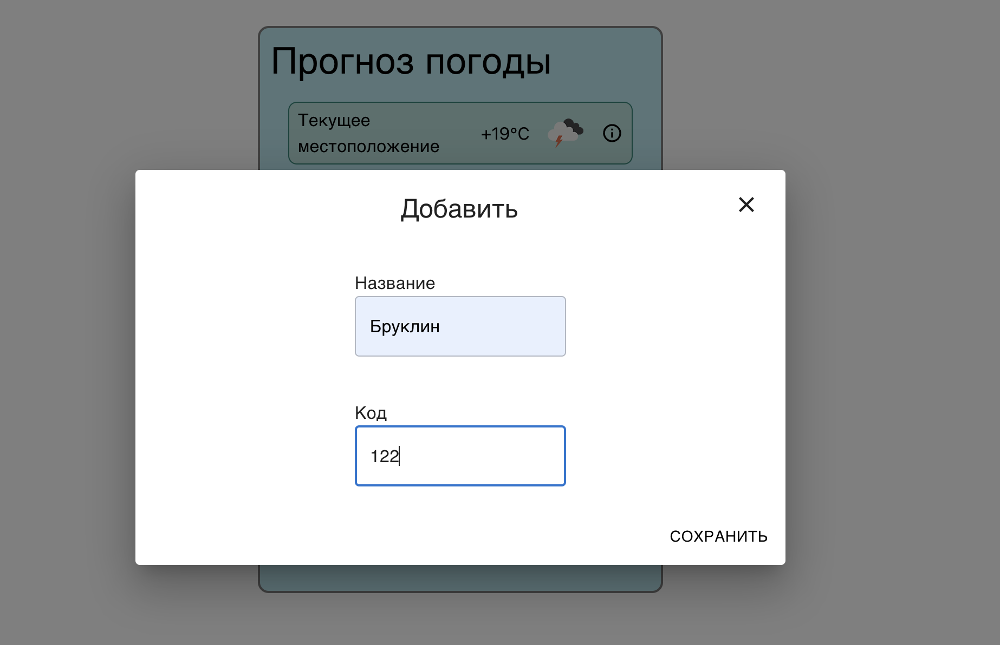
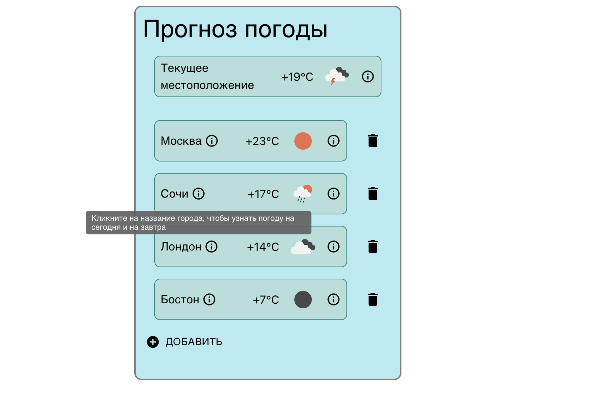
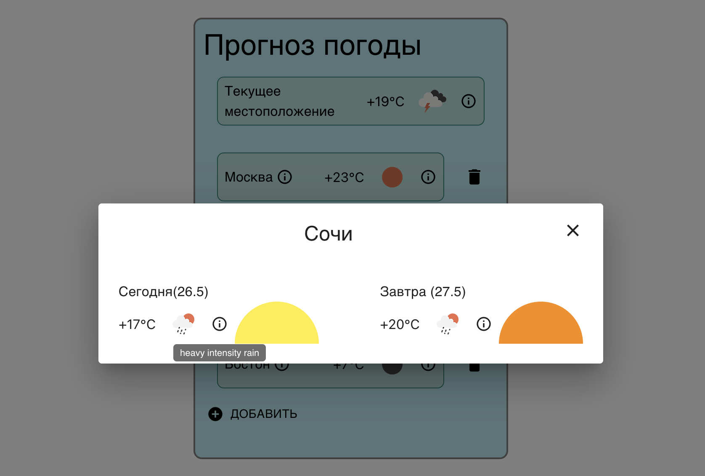

# WeatherApp

Для запуска в браузере необходимо:

Открыть терминал

Необходимо скачать зависимости командой
- npm install

Запустить командой 
- npm start
 
На сайте можно посмотреть погоду в разных городах. Изначально можно увидеть погоду в конкретно вашем городе. Она актуальная на данный момент.
 

 
Далее мы можем можем добавить новый город. Обратите внимание, если  город написан с ошибкой, то мы увидем сообщение, что такой город не найден.

 
 
Также можно заметиь, что есть специальные информационные иконки "i", которые могут нам сказать какая именно пагода в городе.

 
Если какой-то город нам нужно удалить из списка, это можно сделать.
 

 
Если нажать на определенный город, то мы перейдем в подробное описание и увидим погоду на несколько дней.
